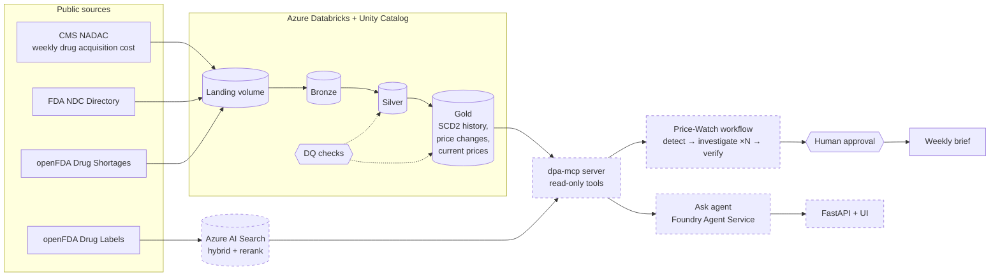

# Drug Pricing Intelligence Agent (Azure)

A multi-agent system for US drug prices and shortages, built on **public data only**
(CMS NADAC, FDA NDC Directory, openFDA Drug Shortages).

- **Ask agent** answers questions on demand, for example:
  > *"Which generic drugs had the biggest price jump this quarter, and is a shortage driving it?"*
- **Price-Watch team** runs every week without being asked: it finds unusual price moves, sends one
  investigator agent per signal to find the cause, verifies every number against the data, and drafts a
  ranked brief that a person approves before it is sent.

Both reach the data through one **MCP (Model Context Protocol) tool server** over a tested Databricks
medallion pipeline.



Dashed boxes are later phases. **This repo currently contains Phase 1: the data layer.**

## Roadmap

| Phase | What | Status |
|---|---|---|
| 1 | Ingestion, Bronze/Silver/Gold, SCD2 price history, data-quality checks, CI, Azure workspace | ✅ done |
| 1b | First run on real CMS/FDA data in Databricks; unpause the weekly schedule | next |
| 2 | Drug labels in Azure AI Search: hybrid search, semantic rerank, citations | |
| 3 | `dpa-mcp` server: read-only tools over Gold, labels and data freshness (managed identity) | |
| 4 | Ask agent on Azure AI Foundry Agent Service using the MCP tools | |
| 5 | Price-Watch multi-agent workflow (Microsoft Agent Framework): SQL signal finder, parallel investigators, verifier, human approval | |
| 6 | Reliability: golden eval set, trajectory evals, calibrated LLM judge, prompt-injection red-team, tracing, model routing and cost per answer, eval-gated CI | |
| 7 | Terraform, FastAPI + review UI on Container Apps, write-up and demo video | |

### Design principle for the agents

Use an LLM only where judgment is needed. Finding price moves is plain SQL (exact, cheap, repeatable);
explaining them is agent work; checking the explanation's numbers is code again. Drug label text is
treated as untrusted input, and every tool is read-only.

## What Phase 1 builds

| Table | Grain | Purpose |
|---|---|---|
| `bronze.nadac`, `bronze.shortages`, `bronze.ndc_directory` | as landed | raw, all strings, `_source_file` lineage |
| `silver.nadac_prices` | NDC × weekly file | typed prices, brand/generic flag |
| `silver.drug_shortages` | shortage record | latest FDA snapshot, NDC normalized |
| `silver.ndc_products` | package NDC | product names, labeler, dosage form, ingredients |
| `gold.nadac_price_history` | NDC × price version | **SCD Type 2** history (`valid_from`, `valid_to`, `is_current`) |
| `gold.fact_price_change` | price change | old/new price and % change |
| `gold.drug_price_current` | active NDC | current price, 90-day and 1-year change, shortage flag; **the agent's main table** |
| `gold.dq_results` | check × run | data-quality results over time |

## Run it locally (no Azure needed)

Needs Python 3.10+ and Java 17+.

```bash
python -m venv .venv && source .venv/bin/activate     # Windows: .venv\Scripts\activate
pip install -e ".[dev]"

pytest -q                                              # 32 tests

python scripts/make_sample_data.py sample_data/landing # synthetic sample in the real formats
python jobs/run.py --local --landing-dir sample_data/landing --step transform
```

Output lands in `_local/` as Parquet. To pull the **real** public data to your laptop:

```bash
python jobs/run.py --local --step all       # downloads to _local/landing, then builds every layer
```

## Deploy to Azure

1. **Create the workspace** (Premium tier is needed for Unity Catalog):
   ```bash
   az extension add --name databricks
   az group create -n rg-dpa -l centralindia
   az databricks workspace create -g rg-dpa -n dbw-dpa -l centralindia --sku premium
   ```
   Set a budget alert on the resource group before anything else.
2. **Create catalog, schemas and the landing volume:** run `setup/00_unity_catalog.sql` in the workspace SQL editor.
3. **Deploy the job** with the [Databricks CLI](https://docs.databricks.com/dev-tools/cli/install.html):
   ```bash
   databricks auth login --host https://adb-<id>.azuredatabricks.net
   # put the same URL in databricks.yml -> targets.dev.workspace.host
   databricks bundle validate
   databricks bundle deploy -t dev
   databricks bundle run dpa_pipeline -t dev
   ```
   The first run backfills two years of NADAC (a few million rows) and builds every layer.
4. **Add table comments:** run `setup/10_gold_comments.sql`. The Phase 3 agent reads these.
5. Unpause the weekly schedule in `databricks.yml` once a manual run is green.

## Design decisions

These are the parts worth explaining in an interview.

- **One join key everywhere.** FDA uses hyphenated 10-digit NDCs in three layouts (4-4-2, 5-3-2, 5-4-1);
  CMS uses 11 digits. `dpa/ndc.py` pads each segment to 5-4-2, as a native Spark expression rather than
  a Python UDF so it stays fast. A bare 10-digit NDC is rejected instead of guessed, because the
  padding position can't be known.
- **SCD2 two ways, proven equal.** `build_price_history` rebuilds history from all weekly files with
  gaps-and-islands; `scd2_staged_updates` + `merge_staged_delta` apply one new week with a single
  atomic Delta MERGE. A test loads week 1, applies weeks 2-8 incrementally, and asserts the result is
  identical to the full rebuild, including NDCs that drop out of NADAC and come back.
- **Drop-outs are not price changes.** An NDC missing from a weekly file closes its version at the last
  date it was seen; when it returns, a new version opens, and `fact_price_change` does not count it as
  a change.
- **Bronze is all strings; Silver is ANSI-safe.** A malformed value in a CMS file becomes null and gets
  caught by a data-quality check, instead of failing the whole run (Spark 4 and newer Databricks
  runtimes have ANSI mode on by default).
- **Schema drift between years.** CMS has changed CSV column order between releases. Each NADAC year
  is read separately and unioned by column name, so values can't silently shift columns. The sample
  data reproduces this on purpose.
- **Idempotent ingestion.** Closed years download once; the current year's cumulative file replaces
  the previous copy; openFDA is snapshotted daily, keeping the last 7. Dataset IDs are discovered from
  the CMS metastore by title because CMS issues a new ID every year.
- **Storage is swappable.** Transforms take and return DataFrames. `DeltaStore` writes Unity Catalog
  tables; `LocalStore` writes Parquet, so the whole pipeline runs and is tested without a cluster.

## Known limitations (good next tasks)

- A CMS correction that changes a price **without** moving the effective date would create two
  versions with the same `valid_from`. The data-quality checks would catch it in a full rebuild, but the
  incremental MERGE would fail first. Fix idea: treat it as an in-place correction in both paths.
- Delta MERGE is exercised on Databricks only; locally the same staged rows are applied by
  `apply_staged_local`, which the equality test covers.
- Shortages are matched to prices by exact NDC. Matching by ingredient (via RxNorm) would catch more.

## Data sources and terms

- [CMS NADAC](https://data.medicaid.gov) (National Average Drug Acquisition Cost): US public domain.
- [FDA NDC Directory](https://open.fda.gov/apis/drug/ndc/) and [openFDA Drug Shortages](https://open.fda.gov/apis/drug/drugshortages/): see the [openFDA terms](https://open.fda.gov/terms/). No API key needed; set `OPENFDA_API_KEY` for higher limits.

The sample data in `sample_data/` is synthetic. This is a portfolio project, not medical or pricing advice.
